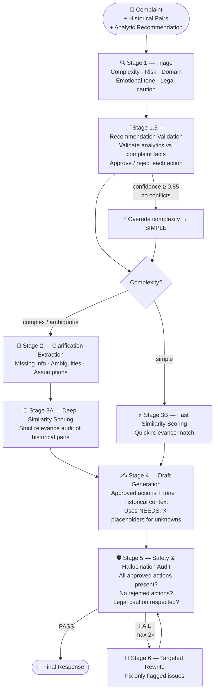

# faaaah 🤖
**F**ault-**A**ware **A**nalytic-**A**ugmented **A**nswer **H**andler

A production-grade, multi-stage LLM pipeline for generating accurate and safe complaint response proposals — powered by Qwen served via vLLM.

---

## Quickstart
```bash
vllm serve Qwen/Qwen2.5-72B-Instruct --host 0.0.0.0 --port 8000 --guided-decoding-backend outlines
pip install openai pydantic
python example.py
```

---

## How It Works

faaaah takes three inputs: a raw customer complaint, a set of historical complaint–answer pairs, and an analytic recommendation produced by an upstream system (e.g. a CRM or ML model). It then runs them through a sequence of specialised LLM calls, each with a strict JSON schema, to produce a safe, grounded, and policy-compliant response proposal.

Every stage is isolated — it receives only the data it needs, produces a typed Pydantic object, and passes it forward. No stage can hallucinate into the next because outputs are schema-validated before use.

### Stage-by-stage logic

| Stage | Name | Purpose |
|---|---|---|
| **1** | Triage | Classifies the complaint by complexity (simple / complex / ambiguous), risk level, domain, emotional tone, key claims, and whether legal caution is required. Sets the routing for the entire pipeline. |
| **1.5** | Recommendation Validation | Cross-checks every action in the analytic recommendation against the actual facts in the complaint. Rejects anything that contradicts the complaint or assumes information not present. If confidence ≥ 0.85 and there are no conflicts, it can override complexity to `simple`, saving two LLM calls. |
| **2** | Clarification Extraction | *(complex/ambiguous only)* Enumerates every gap, ambiguity, and assumption in the complaint. Tags each gap as `blocking` or `non-blocking`. Blocking gaps become `[NEEDS: X]` placeholders in the draft. |
| **3A** | Deep Similarity Scoring | *(complex/ambiguous only)* Strictly scores every historical pair against the complaint, considering the clarification gaps. Extracts only the verbatim excerpt that directly applies. |
| **3B** | Fast Similarity Scoring | *(simple only)* Lightweight relevance pass over historical pairs — no clarification context needed. |
| **4** | Draft Generation | Assembles the final response using approved actions, the correct tone, applicable historical excerpts, and placeholder markers for unknowns. Never adds unapproved actions. |
| **5** | Safety & Hallucination Audit | Verifies every factual claim against source material. Checks all approved actions are present and no rejected actions appear. Flags legal caution violations. Assigns severity (`critical` / `warning`) to each finding. |
| **6** | Targeted Rewrite | *(audit failed only, max 2×)* Fixes only the flagged issues from the audit — does not touch passing sections. Re-enters the audit loop. |

### Routing logic

```
complaint complexity = complex or ambiguous
    → Stage 2 (Clarification) → Stage 3A (Deep Similarity)

complaint complexity = simple
    → Stage 3B (Fast Similarity)

analytics confidence ≥ 0.85 AND no action conflicts
    → override complexity to simple (skip Stages 2 & 3A)

audit fails
    → Stage 6 (Rewrite) → re-audit (max 2 loops total)
```

---

## Pipeline



---

## Pros & Cons

### ✅ Pros
- **Hallucination-resistant** — every factual claim in the draft is audited against the source complaint and historical context before the response is emitted
- **Policy-safe** — approved and rejected actions are enforced at the draft and audit stages; unapproved actions cannot appear in the output
- **Legal caution propagation** — a single `requires_legal_caution` flag from triage suppresses liability admissions and promises across all downstream stages
- **Analytics-augmented** — upstream ML/CRM recommendations are validated against complaint facts rather than blindly applied, preventing confident-but-wrong automation
- **Adaptive routing** — simple complaints skip two LLM calls (Stages 2 & 3A), reducing latency and cost for the majority of tickets
- **Self-correcting** — the audit–rewrite loop catches errors introduced during draft generation without requiring a full pipeline re-run
- **Structured outputs** — every stage produces a typed, schema-validated Pydantic object; there is no free-form string passing between stages
- **Transparent** — placeholders (`[NEEDS: X]`) make gaps explicit rather than hiding them behind fabricated content

### ❌ Cons
- **Latency** — a complex complaint triggers 6–8 sequential LLM calls; even at low latency per call this is not suitable for real-time chat
- **Cost** — each pipeline run consumes significant tokens, especially on the deep similarity and audit stages
- **Single model dependency** — the pipeline is designed around Qwen2.5-72B via vLLM; smaller or weaker models may produce structurally invalid JSON or poor-quality stage outputs
- **No memory** — the pipeline has no conversation state; each complaint is processed in complete isolation
- **Audit loop is bounded** — if the LLM consistently fails the audit (e.g. due to a fundamentally unanswerable complaint), the pipeline emits a partially-failed draft after 2 loops rather than escalating
- **Threshold sensitivity** — the `recommended_threshold` for similarity scoring is LLM-generated and not empirically calibrated; poor thresholds may discard useful historical context

---

## Business Value

| Value | Description |
|---|---|
| 🚀 **Faster resolution** | Agents receive a pre-drafted, policy-checked response proposal rather than starting from a blank page — reducing average handle time |
| ⚖️ **Legal risk reduction** | Automatic legal caution detection prevents agents from inadvertently admitting liability or making unverifiable promises |
| 🎯 **Analytics ROI** | Upstream ML recommendations are validated before use — preventing costly over-compensation or misapplied actions on the wrong customer segment |
| 📋 **Consistency** | Every response follows the same structure (Acknowledgment → Explanation → Resolution → Closing) and tone guidelines, regardless of which agent reviews it |
| 🔍 **Auditability** | All decisions — approved actions, rejected actions, confidence scores, audit findings — are structured and loggable, supporting compliance and QA review |
| 🧩 **Gap surfacing** | `[NEEDS: X]` placeholders make information gaps explicit to the agent, rather than hiding them behind a convincing-but-fabricated response |
| 📉 **Churn prevention** | High-risk, legally sensitive, or VIP complaints are automatically flagged for priority handling and senior escalation |

---

## Structure
- `schemas.py` — All Pydantic schemas
- `llm_client.py` — vLLM client wrapper
- `stage1_triage.py`
- `stage1_5_rec_validation.py`
- `stage2_clarification.py`
- `stage3a_deep_similarity.py`
- `stage3b_fast_similarity.py`
- `stage4_draft.py`
- `stage5_audit.py`
- `stage6_rewrite.py`
- `pipeline.py`
- `example.py`

---

## Safety
- `temperature=0.0` on all analytical stages
- Guided JSON via Pydantic on all stages
- `[NEEDS: X]` placeholders instead of fabrication
- Legal caution propagation through all stages
- Max 2 rewrite loops

---

## License
MIT